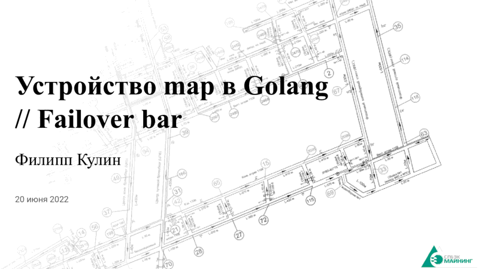

Golang. Устройство map. FAILOVER BAR
=====================================

### Общие сведения

* Что такое хэш таблица

### Устройство

* Выбор хэш-функции
* Корзины
* Поиск и добавление
* Рост

### Специальные случаи
* Размер ключей и значений
* Маленькая таблица

[Скомпилированная презентация](golang-map-internals-fob.pdf)

СПбЭК-Майнинг
-------------

